# Network Task

```
Task 1: Load Balancer Implementation
Objective: Set up HAProxy as a load balancer for web servers
Tasks:
1. Deploy two web servers with different content
2. Install and configure HAProxy as load balancer on a different VM
3. Implement different algorithms:
   * Round-robin
   * Least connections
   * IP hash
4. Configure health checks
5. Test load distribution (you can use Apache Bench or any other testing tool)
Deliverables:
* Complete HAProxy configuration file
* Load balancing test results for each algorithm
* Screenshots of HAProxy statistics page
* Performance comparison report
* Health check logs
```
#### Creating of webserver

Two webservers from two different linux distros were created. `ubuntus` and `Amazon linux`


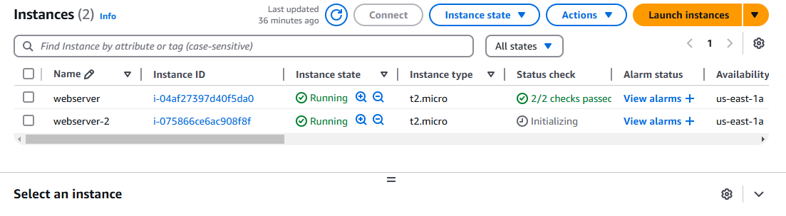

### Rename of the Server

```sudo vi /etc/hostname```

```sudo su -```

changed the name to respective webserver


### Installation of nginx on webserver-1

```sudo yum install nginx```


```sudo systemctl start nginx```

```sudo systemctl status nginx```

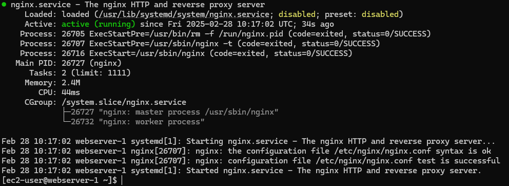

### Installation of Apache on webser-2

```sudo apt-get update```

```sudo apt-get install apache2```

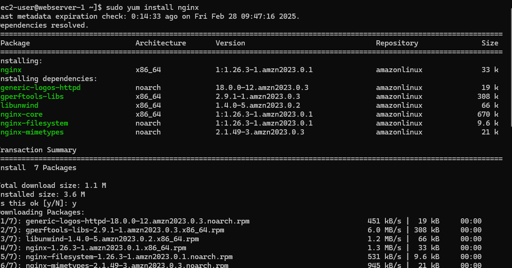

---check the Apache is working---

```sudo systemctl start apache2```

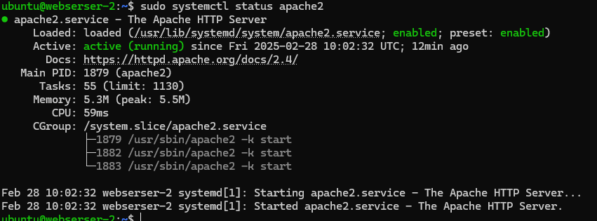

### Set the security group rules for both webservers on AWS

[webserver-1]

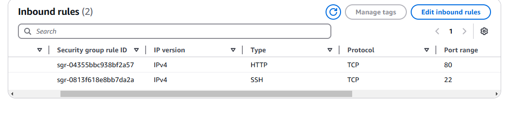

[webserver-2]

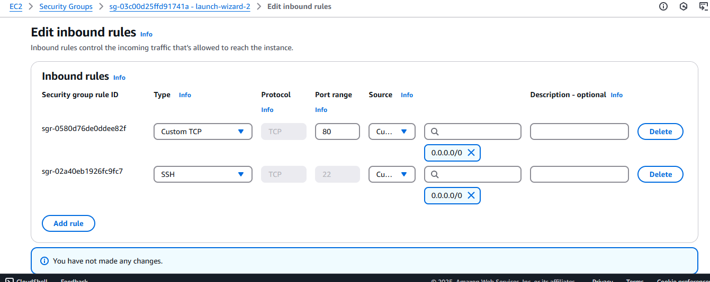

### confirm the nginx and apache are working

```curl http://localhost```

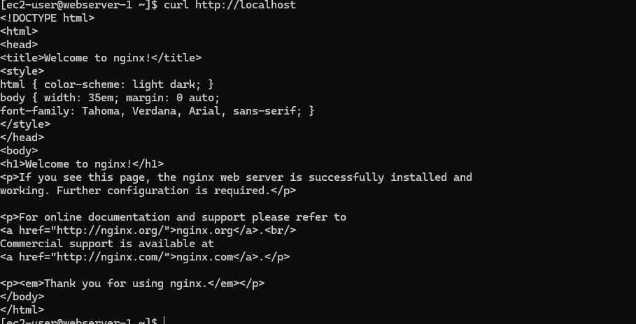

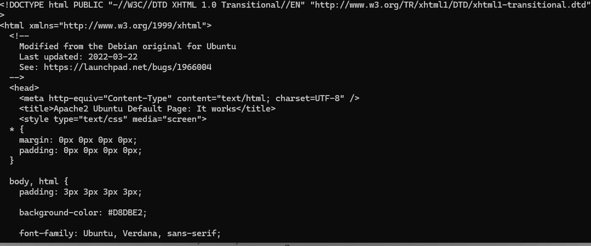

### Create a directory to hold the index.html

For nginx server, this directory might not be available, you have to create.

For Apache server, this directory is available.

To create, the directory, run this code.

```sudo mkdir -p /var/www/html/index.html```

Run this code to copy into the file.

```
echo "<h1>Nginx Web Server</h1><p>This request was served by Nginx.</p>" | sudo tee /var/www/html/index.html

```

```
echo "<h1>This is an Apache configuration. It is our Web Server-2</h1><p>This is the second web se
rver.</p>" | sudo tee /var/www/html/index.html

```

### Creating a Haproxy loadbalancer


Log into the sever using `ssh`

```ssh -i "Haproxy.pem" ec2-user@ec2-54-160-244-191.compute-1.amazonaws.com```

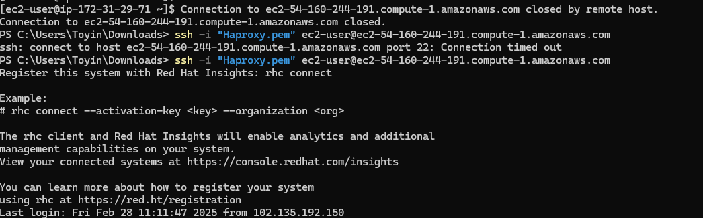

Install the `Haproxy server`

```sudo yum update```

```sudo yum install haproxy```

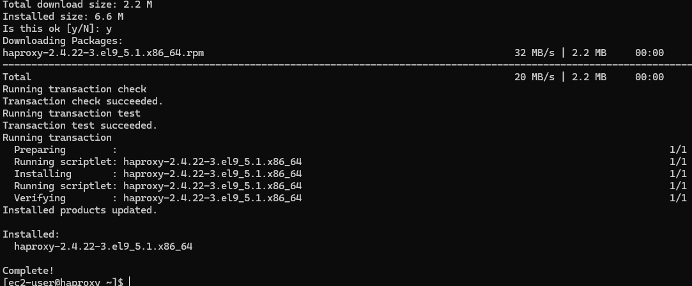

Edit the the config file of the haproxy

```sudo vi /etc/haproxy/haproxy.cfg```

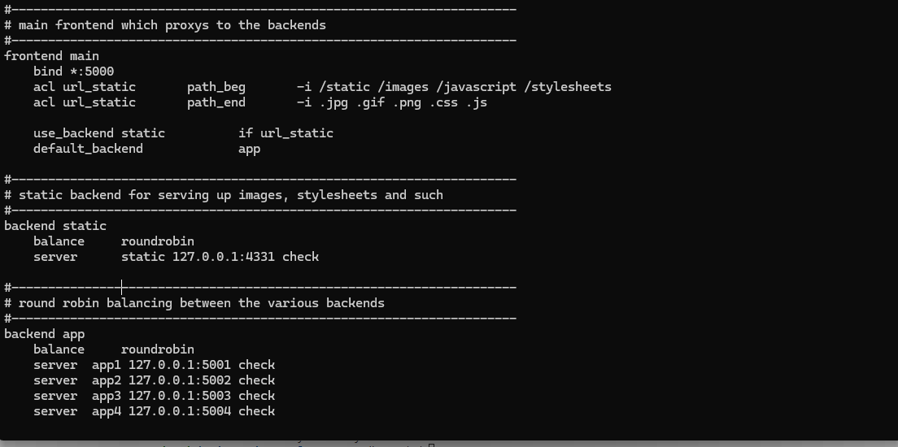

Edit the backend server IP provider by replacing it with the `nginx` and `apache` IP

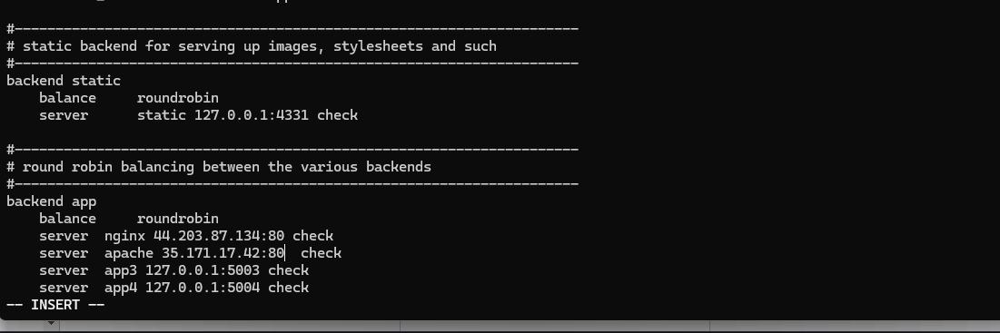

Confirm `haproxy server is working efficiently

```sudo haproxy -c -f /etc/haproxy/haproxy.cfg```

```sudo systemctl restart haproxy```

```sudo systemctl status haproxy```


## Implementation of Algorithms

Our HaProxy server is a Redhat server, install the various testing tools

[httperf]

```sudo yum install -y libtool```

[AB testing]

```sudo yum install httpd-tools```


#### Setting Logging on Haproxy Server Redhat

1. Creating the path for the log  set in the config file
   
   ```sudo vi /var/log/haproxy.log```
   
2. Create directory for the Haproxy dev

   ```sudo mkdir /var/lib/haproxy/dev```

3. Create a config file within the `Rsyslog` to collect log

    ```sudo vi /etc/rsyslog.d/haproxy.conf```

   Paste the following code into the config file
   
   ```$AddUnixListenSocket /var/lib/haproxy/dev/log

# Send HAProxy messages to a dedicated logfile
:programname, startswith, "haproxy" {
  /var/log/haproxy.log
  stop
}
```
4. Run this command ```getenforce```, if `enforcing` is return, follow the steps below, but `permissive` or `disable`

run this command ```sudo systemctl restart rsyslog```

5. Create a file `rsyslog-haproxy.te`

  ```sudo vi rsyslog-haproxy.te```

6. Paste into the file the following command

```
module rsyslog-haproxy 1.0;

require {
    type syslogd_t;
    type haproxy_var_lib_t;
    class dir { add_name remove_name search write };
    class sock_file { create setattr unlink };
}

#============= syslogd_t ==============
allow syslogd_t haproxy_var_lib_t:dir { add_name remove_name search write };
allow syslogd_t haproxy_var_lib_t:sock_file { create setattr unlink };

```

7. Run the following to command to change the `policy` package. which would change enforcment

  ```sudo yum install checkpolicy```

  ```sudo checkmodule -M -m rsyslog-haproxy.te -o rsyslog-haproxy.mod```


  run `semodule_package` to generate a complete policy package that SELinux can load into the Linux kernel:

  ```sudo semodule_package -o rsyslog-haproxy.pp -m rsyslog-haproxy.mod```

  ```sudo semodule -l |grep rsyslog-haproxy```

8. Restart you `Rsyslog`

```sudo systemctl restart rsyslog```

[Haproxy logging](https://www.digitalocean.com/community/tutorials/how-to-configure-haproxy-logging-with-rsyslog-on-centos-8-quickstart)


